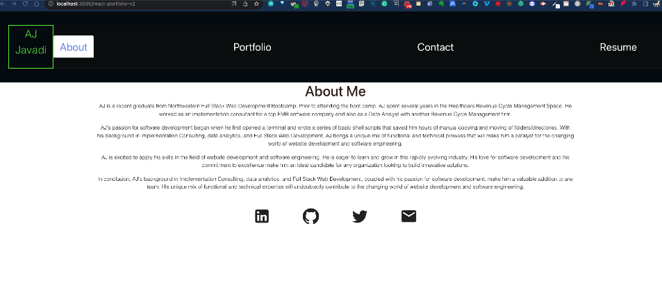

# react-portfolio-v2

## Description
This is my portfolio page. It is a single page application that uses React components to render the page. It is a responsive design to make it mobile friendly. It is deployed on GitHub Pages. 

The goal for this project was to learn about the different React components and how building sepearte components can make it easier to build a page. I also learned about the different ways to style a page using React.

The main hurdle I faced when working on this project was deploying it to GitHub Pages. 

With more of the focus being on the React components, I did not spend as much time on the styling of the page. I would like to go back and add more styling to the page.


## Table of Contents 
- [react-portfolio-v2](#react-portfolio-v2)
  - [Description](#description)
  - [Table of Contents](#table-of-contents)
  - [Installation](#installation)
  - [Usage](#usage)
  - [License](#license)
  - [Badges](#badges)

---


## Installation 

To install, just clone it down
```sh
git clone $REPO_NAME
```

Install dependencies
```sh
npm i
```

Build the react app 
  

```sh
npm run build
```

Open the local host via the web browser (_or the terminal if you're feeling some type of way_)
```sh
open http:/localhost:3000
```


## Usage 


- Users can download my resume
- Users can also fill out the contact form
- Users can click on the links to my GitHub, LinkedIn, and Twitter pages

## License
* MIT

## Badges


